= Exercise 01
:author: Florian Weingartshofer

:source-highlighter: rouge

== Step 01

.01
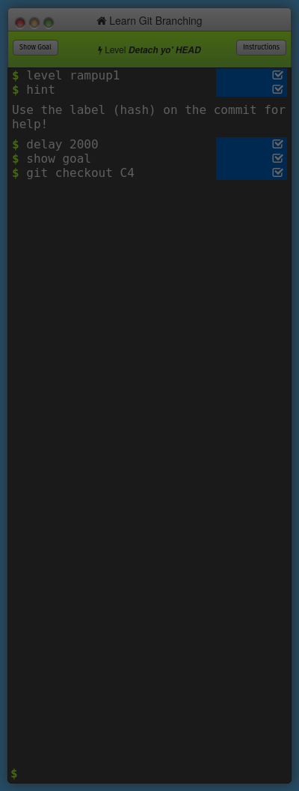

.02

.03

.04

.05

.06

.07
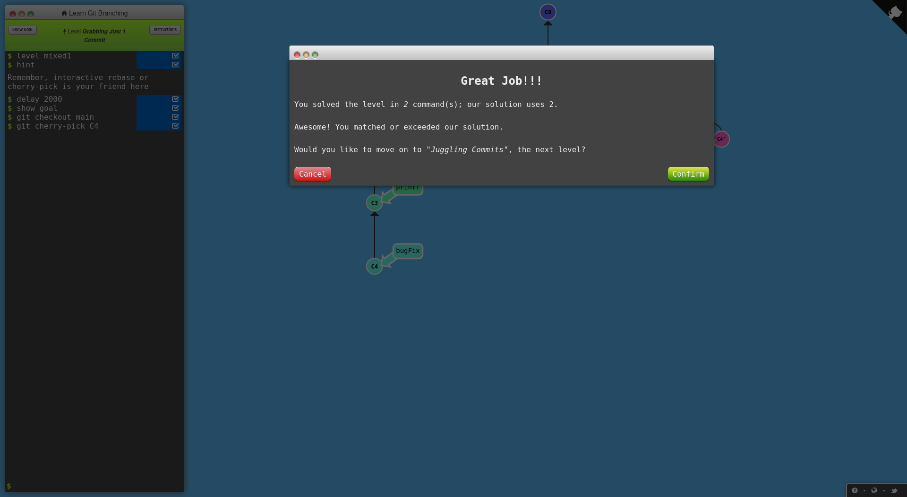

.08

.09
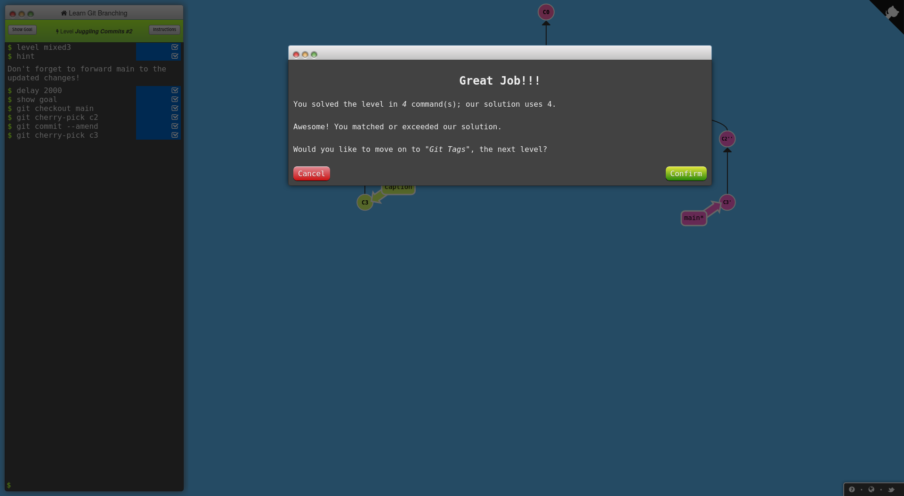

.10

.11
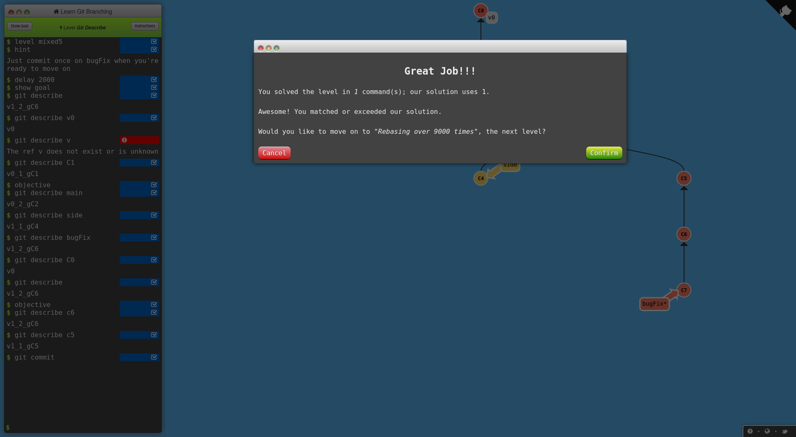

.12

.13

.14

== Step 02

.1
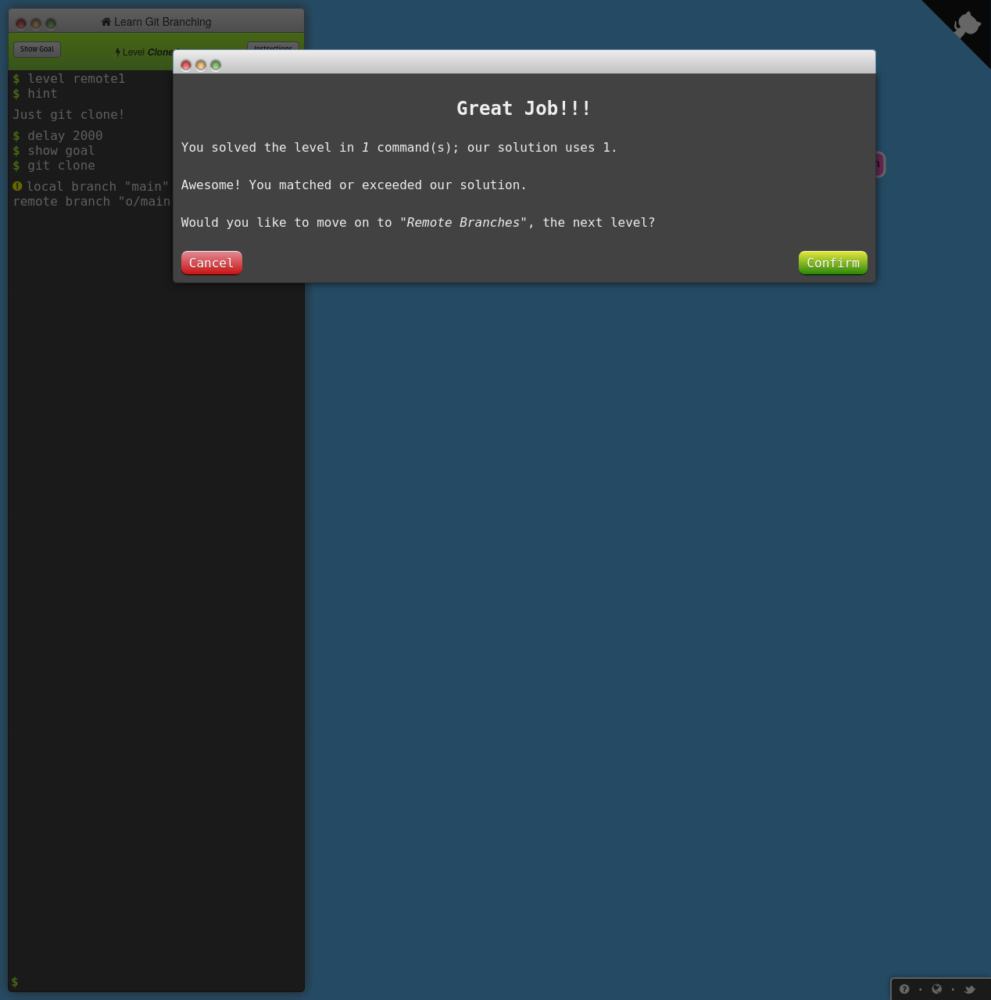

.2
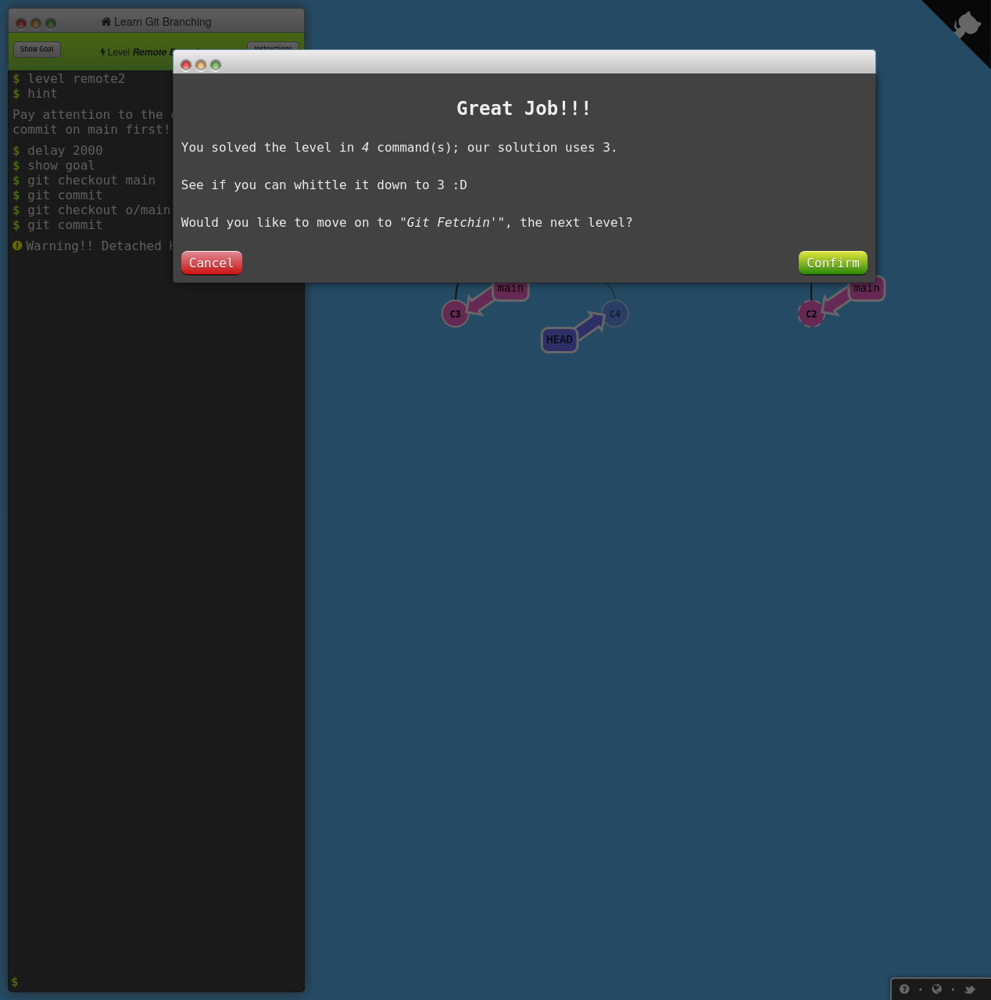

.3
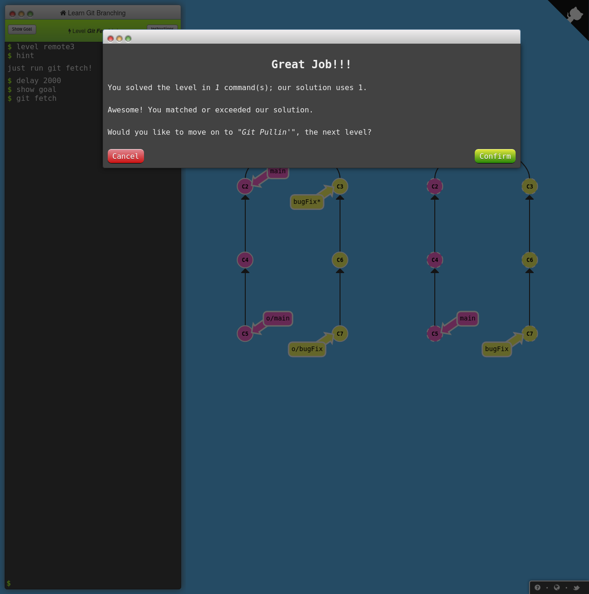

.4
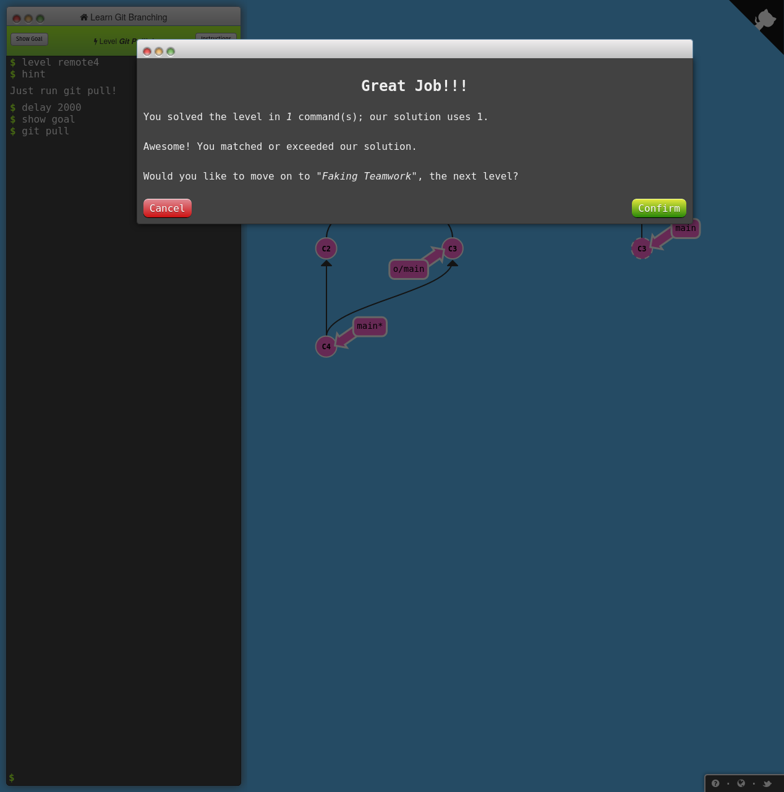

.5

.6

.7

.8
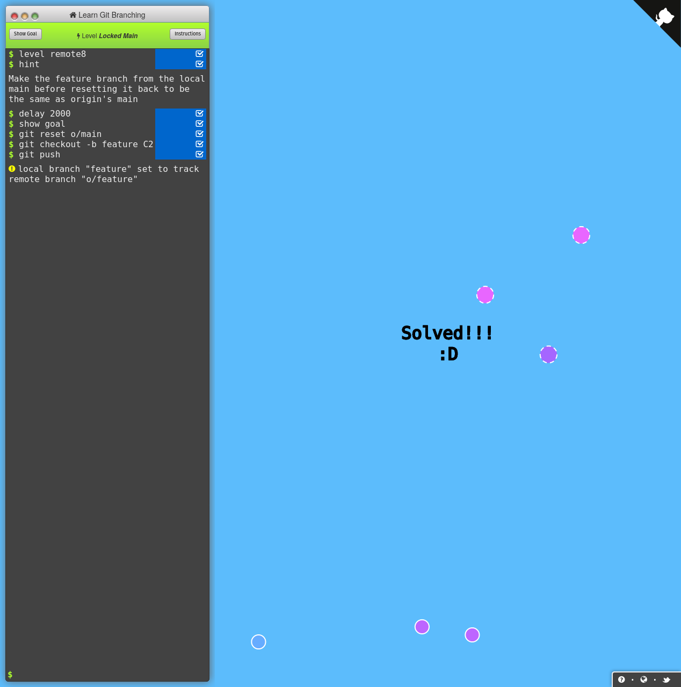

== Step 3

.Rebase ToDo
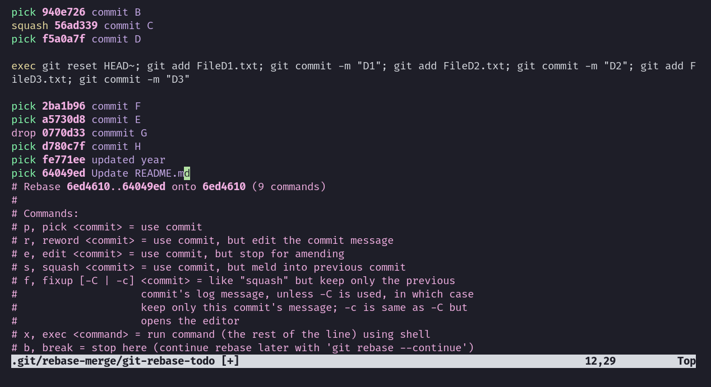

.Rebase ToDo
[source,text]
----
pick 940e726 commit B
squash 56ad339 commit C
pick f5a0a7f commit D

exec git reset HEAD~; git add FileD1.txt; git commit -m "D1"; git add FileD2.txt; git commit -m "D2"; git add FileD3.txt; git commit -m "D3"

pick 2ba1b96 commit F
pick a5730d8 commit E
drop 0770d33 commmit G
pick d780c7f commit H
pick fe771ee updated year
pick 64049ed Update README.md
----

.Resulting Git History
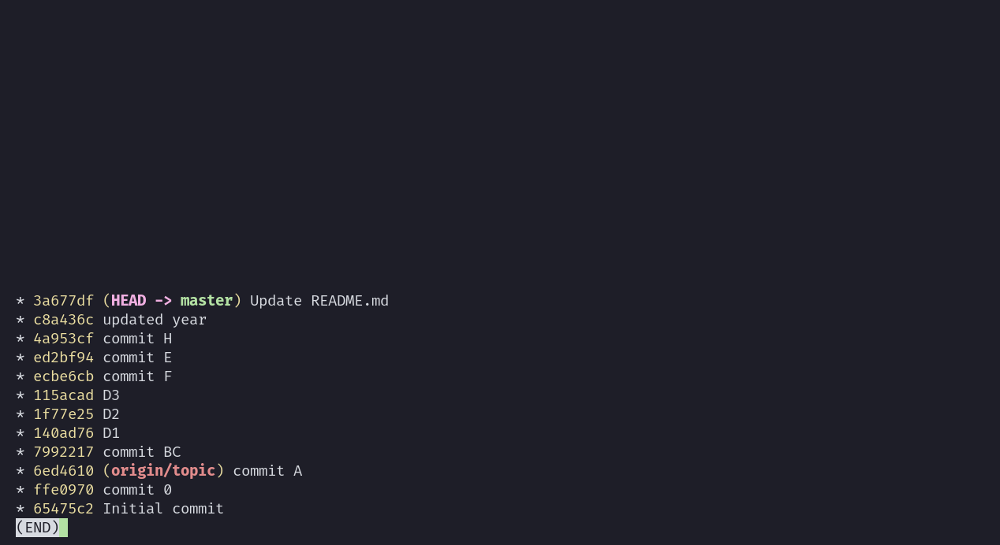

== Step 4
`git rerere` is a feature in Git that stands for "reuse recorded resolution".
It is designed to help automate the resolution of conflicts that occur during the merging or rebasing of branches.

Whenever Git encounters a conflict during a merge or rebase operation, it will prompt the user to resolve the conflict.
Once the user has manually resolved the conflict, `git rerere` can record the resolution and reuse it for future conflicts involving the same set of files and changes.
This means that if the same conflict arises again in the future, `git rerere` can automatically apply the previously recorded resolution, saving the user time and effort.

It can be used, for example, in a situation when working on a long-lived branch that frequently merges changes from other branches.
In this scenario, git rerere can help to avoid re-solving the same conflicts each time when changes are merged from other branches into the long-lived branch.