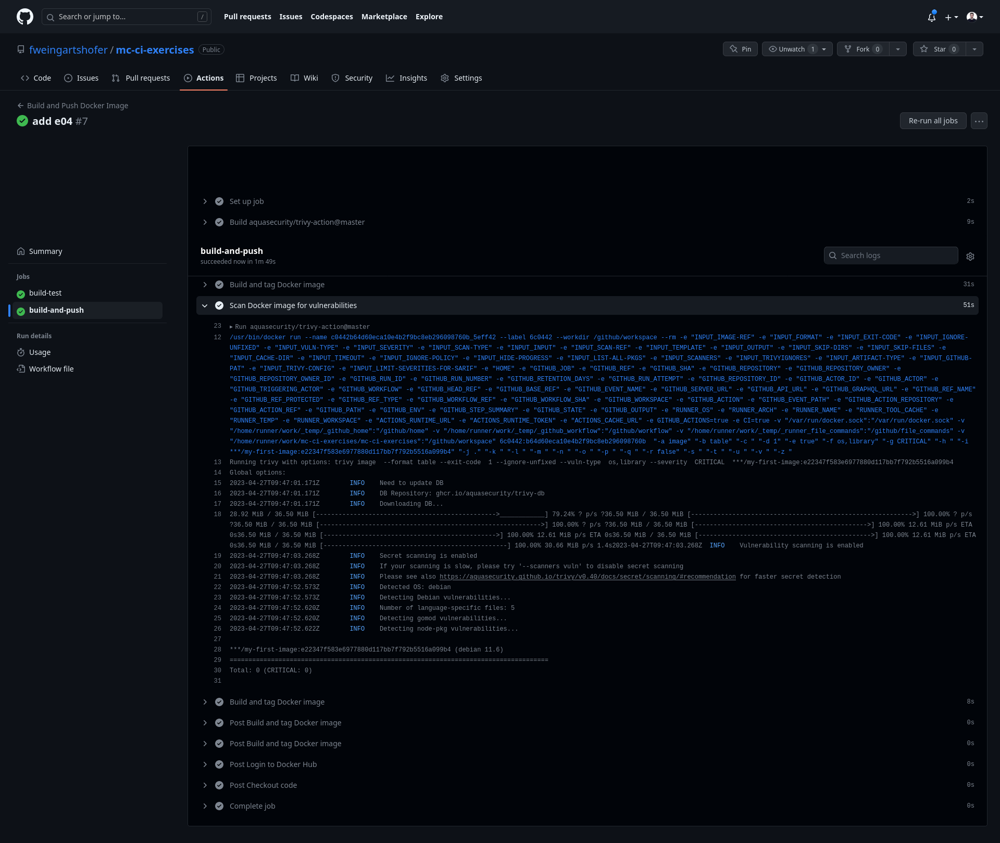

= Exercise 04
:source-highlighter: rouge
:author: Florian Weingartshofer
:rouge-style: github

https://github.com/fweingartshofer/mc-ci-exercises[Github Repository]

== Step 01
.Dockerfile
[source,dockerfile]
----
include::./Dockerfile[]
----

.Build

.Login

.Push

== Step 02
.Run
[source,bash]
docker container run -p 9090:8888 fweingartshofer/my-first-image:0.0.1

.Curl

.PS

.Stop

== Step 03

.GitHub Action
[source,yaml]
----
include::../.github/workflows/build.yaml[]
----

.Docker Hub Push

.Github Action Run

.Run New Image

.Curl new Image

== Step 04

.Trivy Scan
