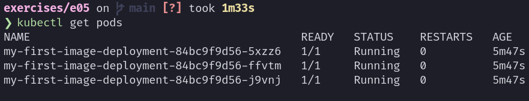
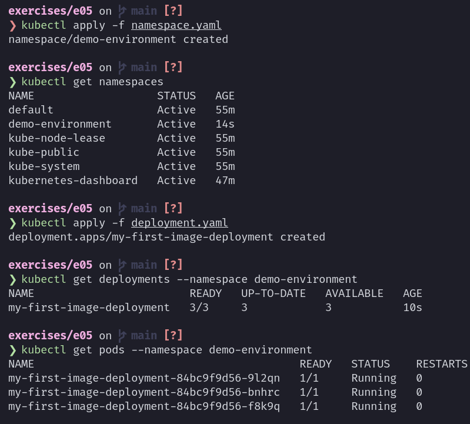

= Exercise 05
Florian Weingartshofer
:source-highlighter: rouge
:author: Florian Weingartshofer
:rouge-style: github

== MiniKube Setup
The setup for MiniKube on linux with a rootless docker installation is a bit different to the normal setup.

Add this line to `/etc/default/grub`:

[source,bash]
GRUB_CMDLINE_LINUX_DEFAULT="intel_iommu=on"

and run the following commands to enable delegations according to https://github.com/kubernetes/minikube/issues/14871[this GitHub Issue]:

[source,bash]
----
$ sudo mkdir -p /etc/systemd/system/user@.service.d
$ cat <<EOF | sudo tee /etc/systemd/system/user@.service.d/delegate.conf
[Service]
Delegate=cpu cpuset io memory pids
EOF
$ sudo systemctl daemon-reload
----

Then MiniKube can be started:

.Dashboard

== Run Container
Run the container:

[source,bash]
kubectl run demo --image=fweingartshofer/my-first-image:518fc3bb820f51989e69b6f3cba563257db09145 --port=8888 --labels=app=demo

Check if pod is running and enable forwarding:

> Now, access the website http://localhost:8888. What is shown there?

The website that was built https://github.com/fweingartshofer/mc-ci-exercises/blob/main/e04/README.adoc[here].

Now delete the pod:

== Create deployment

.deployment.yaml
[source,yaml]
----
include::deployment.yaml[]
----

.Create Deployment

.Port Forwarding

> Now, access the website http://localhost:8888. What is shown there?

The website that was built https://github.com/fweingartshofer/mc-ci-exercises/blob/main/e04/README.adoc[here].

Query pods, there are already three pods, because I configured three replicas in the `deployment.yaml`.

Delete pods and query them again.
As we can see the pods were recreated.

== Create Service

.`service.yaml`
[source,yaml]
----
include::./service.yaml[]
----

Tunneling must be enabled.

== Create Namespace
.`namespace.yaml`
[source,yaml]
----
include::./namespace.yaml[]
----

